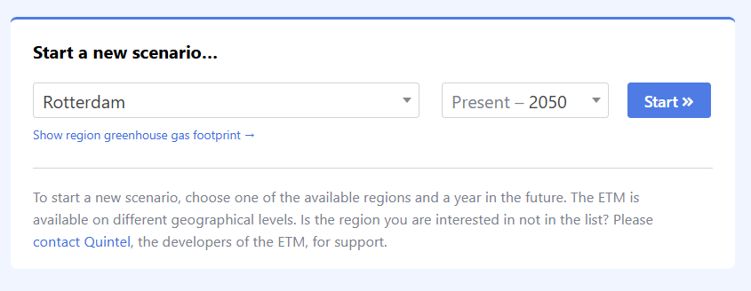

# Exercises 2: Scenario modelling

## Exercise 1: "Reproducing household heating scenarios"
*This exercise helps you understand the basic ETM interface and scenario analysis workflow.*

Your task is to recreate two heating scenarios similar to the tutorial using the ETM:

1. Set up the base scenario:
   - Open the [II3050 National Leadership scenario](https://energytransitionmodel.com/saved_scenarios/14553) for the Netherlands in 2050
   - Navigate to the household heating section
   - Document the initial network capacity requirements by adding the `Electricity network capacity and peaks` table to your view
   - Record the following metrics:
       - Network capacity change (GW)
       - Number of blackout hours
       - System cost changes

2. Chang the scenario (100% air heat pumps):
   - Modify the heating parameters so that we switch to 100% air heat pumps
   - Record the following metrics:
     - Network capacity change (GW)
     - Number of blackout hours
     - System cost changes

3. Write a brief summary comparing your results with those presented in the tutorial.

## Exercise 2: "Analyzing system interactions in the ETM"
*This exercise develops your understanding of how different energy system components affect each other.*

Investigate how different combinations of heating technologies and EV charging strategies affect system stability:

1. Starting from the (https://energytransitionmodel.com/saved_scenarios/14553) , create three variations:
   - Variant 1: 50% air heat pumps, 50% district heating, default EV charging
   - Variant 2: Same heating mix but increase EV "Deployable capacity" to 80%
   - Variant 3: Your own combination targeting minimal grid impact

2. For each variant, analyze:
   - Grid stability indicators (blackout hours, network capacity)
   - System costs
   - Biomass import requirements

3. Write a short analysis that:
   - Explains the observed system interactions
   - Identifies unexpected effects
   - Recommends the most robust configuration

## Exercise 3: "Designing a resilient Rotterdam energy system"
*This exercise helps you apply ETM analysis to real-world energy planning challenges.*

1. Start a new scenario for the region of Rotterdam (see screenshot), you can type and search in the dropdown

1. Use the ETM to develop two contrasting energy system configurations:
   - Configuration A: Maximize renewability of the energy-mix through deployment of renewable energy generation
   - Configuration B: Reduce emissions of the Rotterdam energy system by 50% (CO2 emissions relative to 1990) without using more than 150% import

:::{hint}
For higher **renewability**, increase the deployed capacity of wind turbines in `Supply > Renewable electricity > Wind turbines`. 
To effectively reduce emissions in the Rotterdam region, change the energy sources of industries `Demand > Industry`. This is 80% of the total energy demand. 
:::

1. For each configuration analyse:
   - Technical specifications for both configurations
   - Comparison of infrastructure requirements
   - Cost-benefit analysis
   - Recommendation with justification based on resilience, costs, and environmental impact